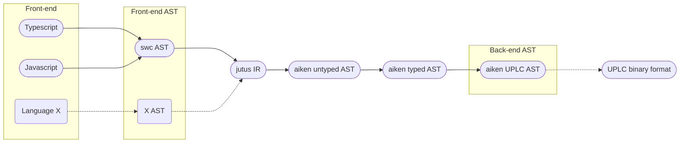

## Jutus - Plutus for the masses

In "Jutus", "J" is from "**J**avascipt" and "utus" is from
"Pl**utus**". With "Javascript" we mean both Javascript and
Typescript.

### What

As a Plutus contract developer, I want to write my Smart Contracts in
Javascript.

### Why
The world has
[25 million](https://www.theregister.com/2021/04/26/report_developers_slashdata/)
developers, and
[half of them](https://www.inapps.net/how-many-software-developers-are-in-the-world/#JavaScript_developers)
use Javascript. The web is the global platform. So, let's write
Plutus by writing in Javascript !

### How?

We use both established and emerging open source components and glue
them together in a most (cost-)effective way in order to produce an
end-to-end compilation pipeline. Our strategy is as follows:

- We use [`swc`](https://swc.rs/) to parse Javascript into their
  Abstract Syntax Tree (AST).
- We transform the `swc` AST to our own Intermediate Representation (IR).
- We compile our IR to [`aiken`](https://github.com/txpipe/aiken) AST(s).
- We use `aiken` to type-check and compile to their Untyped Plutus Core
  (UPLC) representation. From here it should be straightforward
  (via `aiken` again) to generate the binary representation of UPLC.

You may want to check the section on [architecture](#architecture) for a
visualization of the above.

This is a feasibility study and a proof-of-concept, and, as such, not ready
for production. But the results are positive, in the sense we prove that
the original idea is doable. We can also take the whole work a step
further by using our IR as a compilation target for other languages. For
instance, one could write Plutus smart contracts in Python.

We chose Rust as the implementation language because everything we needed
was already there in Rust. This is a very pragmatic and modern language
with a huge ecosystem.

Please check the examples folder if you want to follow the logic of how
everything fits together. The whole compilation pipeline can also be
seen encoded as `pub fn end_to_end` in `js_compiler.rs`.

#### Architecture

Here is the general compilation pipeline architecture. Dotted lines denote
something enabled by this project but not implemented yet.

